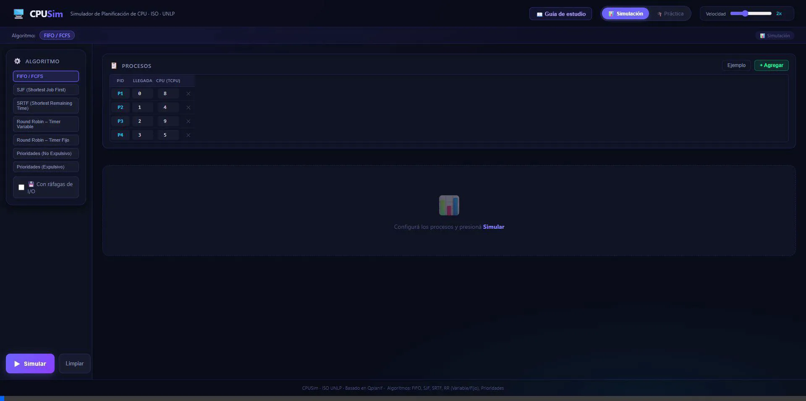

<div align="center">
  
  
  <h1>CPU Scheduler Sim</h1>
  <p><em>Un simulador web interactivo para visualizar, entender y practicar gráficamente los principales algoritmos de planificación de CPU.</em></p>

  <p>
    <a href="https://cpusim.agustinolthoff.online"><b>Probar Simulador Online 👉</b></a>
  </p>

  <p>
    
    
    
    
  </p>
</div>

<br>

> Este proyecto nació con el enfoque de ayudar en la materia **Introducción a los Sistemas Operativos (ISO) de la UNLP**, permitiendo entender exactamente qué ocurre con el procesador tick por tick cuando se cargan distintos procesos, prioridades, o bloqueos por Entrada/Salida.

## Algoritmos soportados

El motor de simulación incorpora la lógica matemática para probar 7 variantes de algoritmos (con y sin ráfagas de I/O):
- FCFS (First-Come, First-Served)
- SJF (Shortest Job First)
- SRTF (Shortest Remaining Time First)
- Round Robin (variantes con Quantum variable y estricto)
- Prioridades (versiones expropiativas y no expropiativas)

## Características core

- **Visualización en tiempo real:** Carga configuraciones por proceso y observá cómo se dibuja automáticamente la línea de tiempo (Diagrama de Gantt), desglosando la Ready Queue (cola de listos) y calculando métricas de Tiempo de Retorno (TR) y Tiempo de Espera (TE).
- **Entrada/Salida compleja:** Un módulo exclusivo que permite simular llamadas DMA. Cada proceso puede tener múltiples pausas en ticks específicos donde libera la CPU temporalmente y se va a la cola de bloqueados para resolver discos duros, red o pantallas, introduciendo un nivel de caos técnico real.
- **Modo Práctica:** Una plataforma estilo examen. En lugar de que el sistema te resuelva el planteo, el simulador genera un escenario aleatorio (fácil, regular o complejo) y te pide que vayas diagramando la resolución clickeando las celdas manualmente. Al final te da retroalimentación marcando las equivocaciones.
- **Compartir estados:** Cada escenario creado, ya sea manual, en práctica, importado o con algoritmos mezclados, se encripta para que lo puedas copiar, enviar por WhatsApp o exportar directamente a formato `.png` como comprobante.

## Ejecución en entorno local

Si querés bajar el código, ver cómo funciona por detrás o sumarle algo, el sistema está construido puramente sobre React + Vite y una arquitectura de hojas de estilo vanilla. Funciona súper liviano. 

Para levantarlo en tu propia computadora:

1. Abrí tu consola y traete el repositorio:
```bash
git clone https://github.com/auwus21/cpu-scheduler-sim.git
```

2. Entrá al lugar que se clonó:
```bash
cd cpu-scheduler-sim
```

3. Instalale las dependencias de Node.js:
```bash
npm install
```

4. Prendé el servidor local:
```bash
npm run dev
```

La consola te va a escupir una dirección web `localhost`, tocala y te abre la app en el navegador para que metas mano.

---
Si tenés ideas para mejorar el refactor, meter lógica predictiva o testear errores locos en la simulación, abrite un PR.
